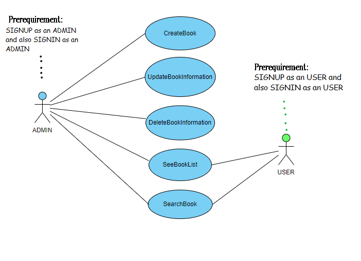

# BooksLibrary
### Library System 
##### This system supports  CRUD operation along with the Authentication and Authorization.
      
 >#### Here I use:
 >#### 1. python flask for the backend.
 >#### 2. Mongo Db for the database .
 >####3. Postman for the  API.
___
 * For knowing the requirement of this project you can see this file 
    `Book Library Requirement.pdf`
 
* Here I draw the Use case Diagram for better Understanding about the functionalities at a glance :
      
######        
     dependecy:
      pip install python-flask
      pip install flask-RESTful
      pip install pymongo
      pip install kanpai
      pip install JWT-Extended 
      pip install passlib
      pip install bson
      pip install json
      
      you can run this command from your command prompt or you can do it Pycharm file settings and 
      install those packages .
 ___
     app.py
     before run this file , connect to the mongoDB .
     
>###### you can have the full API collection with the details in this link below :
 [Visit here] (https://documenter.getpostman.com/view/10916826/SzezaWGX?version=latest "BookLibraryAPI")
     
     download this collection and import it to the Postman.
     import the environment file to the environment. Or you can directly run  from their.
     Then you can start to request API.
 ___
  
      apptest.py
       
       for testing you have to import the package 
       
       python uninttest
      
      here is 10 testcases along with the successful one and the unsuccessful one. here each test function
      have  all the  details how it works.
 ___
 
 
 
 
       
      
